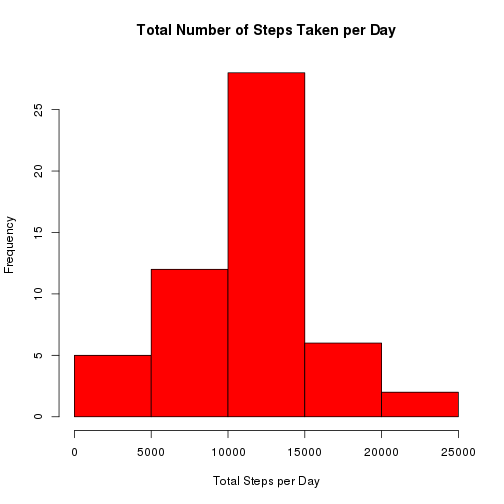
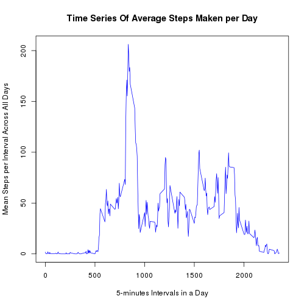
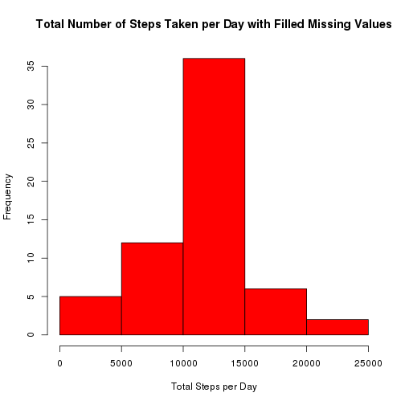
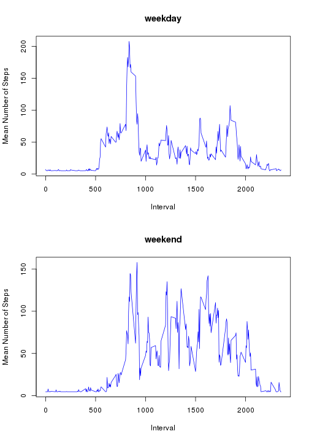

## Loading the data from my local reposiroy


```r
setwd ("/home/jdjomo1/DataScientist/RepData_PeerAssessment1")
activity <- read.csv(unz("activity.zip", "activity.csv"))
```

## Cleasing data: Separate missing data observations from the rest


```r
actNA <- activity[!complete.cases(activity), ]
activity <- activity[complete.cases(activity), ]
```

## Calculate the mean total number of steps taken per day
### Total number of steps taken per day


```r
total_steps <- data.frame(with(activity, tapply(steps,date,sum)))
total_steps <- total_steps[complete.cases(total_steps), ]
```

### Histogram of total number of steps taken per day

```r
hist(total_steps, main="Total Number of Steps Taken per Day", xlab="Total Steps per Day", col="red")
```

 

### Calculate the mean and the median of the total steps taken per day

```r
mtotal_steps <- mean(total_steps)
mdtotal_steps <- median(total_steps)
```

This is a brief summary of the total steps taken per day:

- the mean is 1.0766189 &times; 10<sup>4</sup>

- the median is 10765

## Average daily activity pattern
###  Time series plot

```r
time_steps <- data.frame(with(activity, tapply(steps,interval,mean)))
time_steps[2] <- rownames(time_steps)
names(time_steps) <- c("MeanS","Interval")
Max_Mean_Interval <- time_steps[time_steps$MeanS == max(time_steps$MeanS), ]$Interval
with(time_steps, plot(Interval, MeanS, type="l", main="Time Series Of Average Steps Maken per Day", xlab="5-minutes Intervals in a Day", ylab="Mean Steps per Interval Across All Days", col="blue"))
```

 

835 is the 5-minutes interval, average across all the days in the dataset, that contains the maximum number of steps.

## Imputing missing values
### Build the new histogram with missing values filled

```r
Num_NA <- nrow(actNA)
actNA$steps <- mtotal_steps / 288
activity_n <- rbind(activity, actNA)
total_steps <- data.frame(with(activity_n, tapply(steps,date,sum)))
total_steps <- total_steps[complete.cases(total_steps), ]
```
The original dataset has 2304 rows containing missing values. Our strategie here is to imput the missing values with the mean of total steps taken per day divided by 288. This being said, here is the new histogram:

```r
hist(total_steps, main="Total Number of Steps Taken per Day with Filled Missing Values", xlab="Total Steps per Day", col="red")
```

 

### Calculate the new mean and the median of the total steps taken per day

```r
mtotal_steps <- mean(total_steps)
mdtotal_steps <- median(total_steps)
```

This is a brief summary of the total steps taken per day:

- the mean is 1.0766189 &times; 10<sup>4</sup>

- the median is 1.0766189 &times; 10<sup>4</sup>

Looking at the histograms and the values of the means and medians, our strategy confirms the initial distribution.

## Are there differences in activity patterns between weekdays and weekends?
### New factor variable representing 2 levels: weekend and weekday

```r
activity_n$Type_Day <- as.factor(ifelse(weekdays(as.Date(activity_n$date)) %in% c("Tuesday", "Wednesday", "Thursday", "Friday", "Monday"),"weekday","weekend"))
weekT <- function(wt){
  temp <- activity_n[activity_n$Type_Day == wt, ]
  temp <- data.frame(with(temp, tapply(steps,interval,mean)))
  temp[2] <- rownames(temp)
  names(temp) <- c("MeanS","Interval")
  with(temp, plot(Interval, MeanS, type="l", main=wt, ylab="Mean Number of Steps", col="blue"))
}
par(mfcol=c(2,1))
for (i in c("weekday","weekend")) {
  weekT(i)
}
```

 

